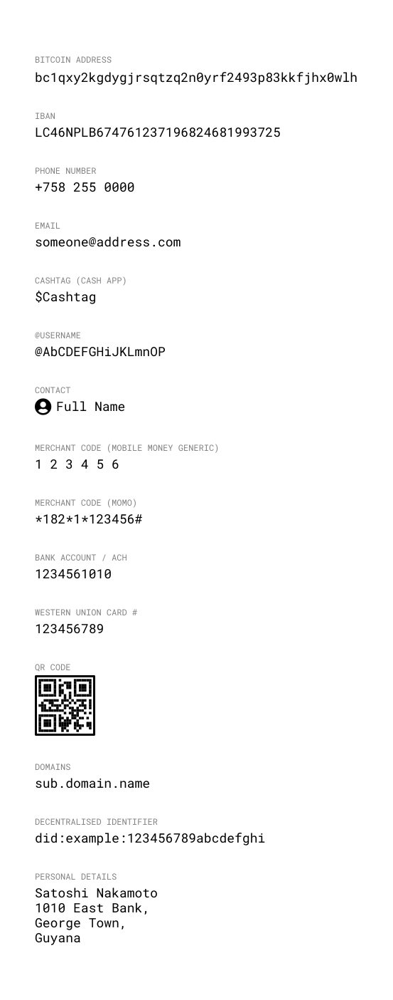

# Account Formats

There are a variety of ways to make a payment — and formats that those accounts are identified by.

The most abstract would be a “Contact” that has never been inputed manually — (through share contact for example).

The most complex one being when you request, verify, then input and verify the account details yourself.

### Bitcoin Address

Addresses are not static, you generate addresses every time you create a payment request in your HD wallet.

### IBAN

IBAN (15-32 chars) can have a similar string length to a bitcoin address (26-35 chars) — but as the format has a structure that contains meta data about who is receiving the funds.

| IBAN                             | Country       |
| -------------------------------- | ------------- |
| LC14BOSL123456789012345678901234 | Saint Lucia   |
| GB33BUKB20201555555555           | Great Britian |
| IT60X0542811101000000123456      | Italy         |

Names, Phone numbers, Usernames and Email Addresses are things we have learned to keep in memory — it is a good example of how technology has influenced behaviour.

---

## Comparisons

Visualisation of Bitcoin Addresses and other account identification formats.

