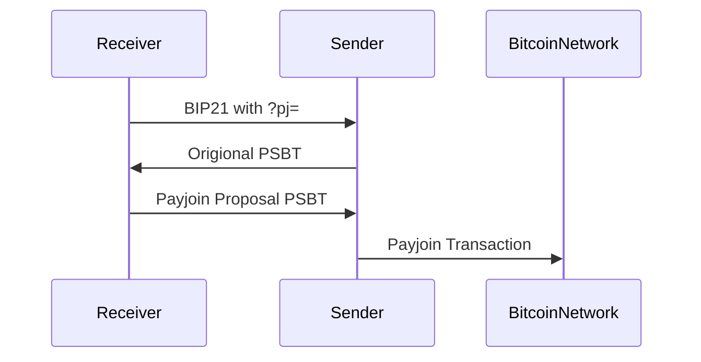
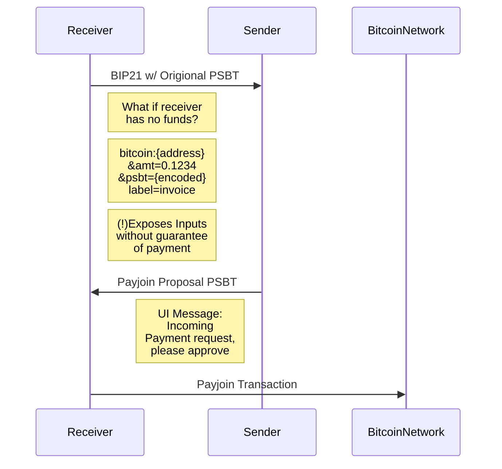

# Simplifiying Payjoin for a Social Use Case

## Abstract

- Payjoin has mostly been demonstrated with a merchant use case.
  - Merchant sets up a P2EP 
  - Why not use a tipin.me like page that you can provide senders?
    - is a hosted service
    - possibilitiy to leak IP address
- How can it be applied in a more social P2P use case vs Business to Consumer
- Receiver needs to be running some online service. For example BTC PayServer which added support for Payjoins in ___. This is yet another online service that needs to be 
  - Are there any other lighter weight options?
  - Wallet needs to be hot?
- Signing servers, watch towers, provide another layer of complexity to adotion of the protocol.
- Setting up a BTCPay Server may not be a viable option for casual users of mobile wallets.
- Reduce the interactions
- Payjoin is an interactive protocol. The receiver creates a payment request via BIP21 with a P2EP parameter (pj=https://...).
  - For increased privacy it would be receomended that this url is behind a TOR hidden service (another piece of infrastrcture that engineers)
## Motivation

  - To describe a PayJoin interaction without the need for a P2EP signing server in order to promote more casual use cases of PayJoin.
- Why not have mobile wallet developers provide a cloud based solution for setting up a BTCPay Server for all mobile wallet users?
  - If we do not support more P2P and low availablity/connectivtiy use cases, we run the risk of centralisation through custodial services, and bitcoin cloud solutions that would eventually pop up. Not everyone wants to run their own hardware, not everyone will -- so its not too speculative to assume cloud services for the following will become more prominant.
    - Watchtowers
    - Lightning Hubs
    - BTC Pay Server
  - STATS FOR USERS ON EXCHANGES / CUSTODIAL WALLETS

## Rationale

In the proposal for BIP78

1. Receiver sends to sender a payment request as BIP21 url `bitcoin:bc1asdf...&pj=https://...`
2. Sender constructs a PSBT and sends it as an encoded payload to the payjoin url that was provided
   1. At this point the receiver is aware of the inputs of the sender, and can broadcast the transaction to the Bitcoin Network without any further interaction. The receiver would have gotten paid, but not had the benefits of privacy.
3. The receiver adds thier inputs and outputs 

### Merchant Use Case

### Social Use Case

## Questions

- What if recevier does not have any coins, is a pay join possible / does it even make sense if it is?
  - Assumes reciever has the amount of coins getting paid
  - How realistic is the application of payjoin in non merchant use cases? e.g. What if I am getting angel investment into my new startup, or a grant?
- What if the receiver does not have exactly the amount they are requesting? 
- Can CoinSwap be an alternative to solve some of these problems?

> *another possibiility is for the receiver to pre-fill their input(s) in the first stage, and save on the last interaction, but that's not how bip 78 is specified, there the initiator is the sender and you don't wan to reveal UTXOs to fake senders*
> -- Nothing much

This may be so in an online shopping scenario when you are interacting with a merchant, but i think this would be different for a more social use case.