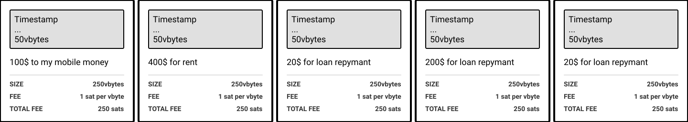
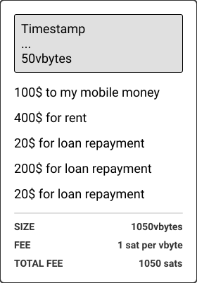

# Transaction Builder



It is possible to send very simple transaction in bitcoin which contain just one operation. This is how most wallets do it these days. One transaction for each payment.

 This is not the most cost effective, or optimised way of handling onchain payments though.

Since a transaction is able to take multiple inputs and outputs. You can essentially allow users to build a transaction that contains multiple operations. Enter, batched payments.

A batched payment is a collection of operations that will all be sent out at the same time, effectively in the same transaction. This has a potential for fee saving mechanism.

## Actions

- Add Inputs
- Add Outputs
- Set Broadcast Time
- Broadcast Now
- Set Replace by Fee (true/false)

## Individual Transactions

There is a fixed overhead for each transaction that is broadcasted. By sending 5 separate transactions this fixed amount is multiplied by 5.

## Batched Transaction

If the transaction is not urgent - it may make sense to allow the user to add multiple payments to a queue. These operations would be scheduled for broadcast at the same time. Since only one transaction is made this time, we can see below that there is a saving of 200 satoshis (given that the transaction fee is 1sat per vbyte).

## Use Cases

1. Refilling/Recharging mobile money/daily spending wallet

2. Planning monthly spending
3. Subscriptions, Loans/Hire Purchase/Installments
4. Make it rain

## Offline Use
Intermittent connection is something we definitely need take better considerations of when designing our payment systems.

Operations can be added to the queue completly offline.

Coins can be selected for a payment to an address or output descritpor and be added to a schedueld transaction.

When the device is online -- the transction can be signed and broadcasted.