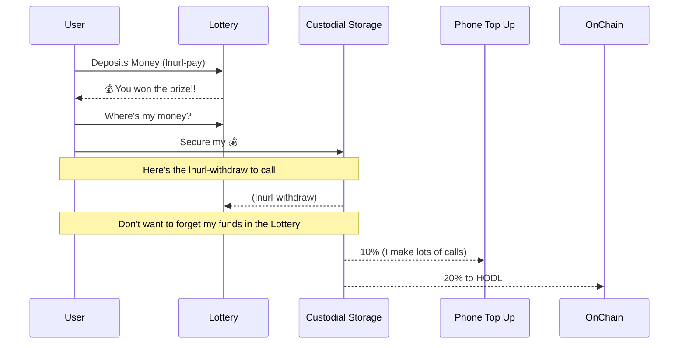

# LNURL

- [ ] research AMP payments
- [ ] https://medium.com/breez-technology/introducing-lightning-service-providers-fe9fb1665d5f

## Components

- lnurl-pay
- lnurl-withdraw
- lnurl-auth

## Use Case

lnurl-pay as an standard for online services to interact with each other automatically.

— credit fiatjaf