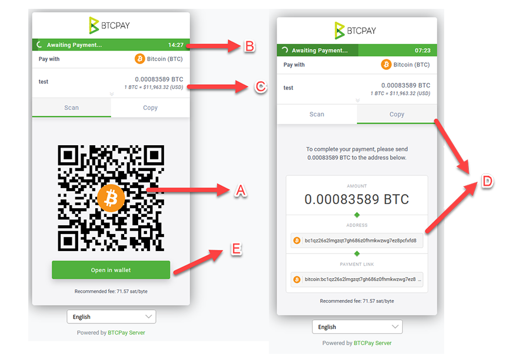

# Invoicing and invoices in Bitcoin payments in a buyer context

This document tries to explain invoices visible on buyer's end in Bitcoin payments. The goal of the *invoice on the sending (buyer) side* is to provide information necessary to pay such invoice. 

## Components of a buyer's invoice (checkout page)

The basic components of an invoice visible to the buyer are:

* A) QR Code with encoded amount and receiving address
* B) Timer which sets invoice to expired (to avoid volatility in rates)
* C) Invoice details (Total Price in fiat, Exchange rate, etc)
* D) Total amount and an address that can be copied separately (for wallet desktop users)
* E) Open in a wallet (Pay in a wallet) a button that opens and auto-populates sender's wallet fields

## Common problems buyers have at a checkout 

Regardless of the payment gateway used, there are some common problems that buyers have when they're preforming a checkout.

### Paying from an exchange (underpaid invoice)

**Problem**: Oftentimes, the buyer pays an invoice from an exchange. Unfortunately, some exchanges consider that a withdrawal, deducting usually a small fee from the total, without communicating that in the UI. That means that once the payment reaches the merchant, it becomes underpaid. Majority of payment processors would then notify via the invoice that there’s a due amount. 
However, even when the user buyer pays, due, the will again be deducted and invoice – underpaid. This not only causes frustration on the buyer’s end, but also increases the cost for the merchant. 
Buyer paying from multiple outputs means that the fee for a merchant who needs to move those funds later will be higher.

**Solution**: Educating both users and exchanges about the potential setbacks when paying directly from an exchange. Exchanges should communicate more transparently and clearer in their UI if they’re deducting a fee from the total.

### Invalid address (Legacy to Bech32)

**Problem**: When a sender is using a legacy wallet and paying to a receiver using Bech32, the majority of wallets provide a poor warning saying that the address is invalid. This causes confusion on the sender's end, leading them to think that the receiver provided an incorrect address.

**Solution**: Besides pushing wallets to adopt Bech32, wallets should provide better and clearer error messages to the end-user. Merchants could use P2SH to mitigate.In my opinion P2SH is just a patch not a solution.  A solution where Bech32 invoice can fallback to P2SH would be a good balance.

## Support tickets related to invoice paying

The following is an example of a real-world support ticket, separated by payment processors, since some queries may differ depending on processor's checkout experience.

#### BTCPay Server

* "What is the payment link" / "Do I use the address or the payment link" 
* QR Code related: "What is this square thing, don't you take debit/visa/paypal?"
* "I made added funds to my account via btcpay but the transaction expired before the payment was confirmed on bloackchain and it never relfected on my account, and no refund to my blockchain either"

Additional resource: [A list of awesome payment processors](https://github.com/alexk111/awesome-bitcoin-payment-processors).
