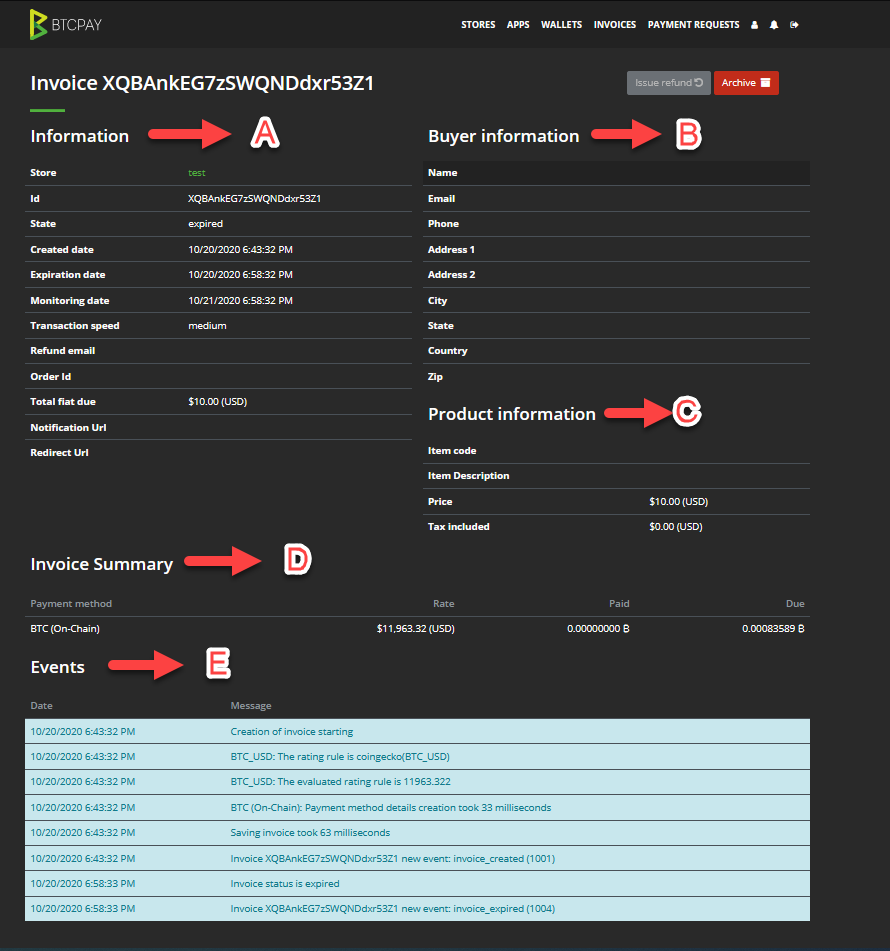
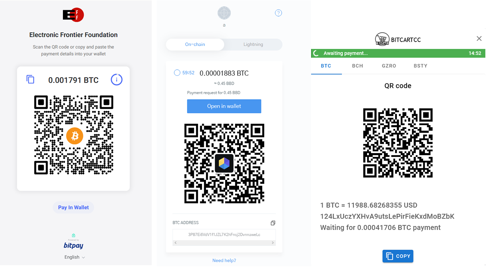
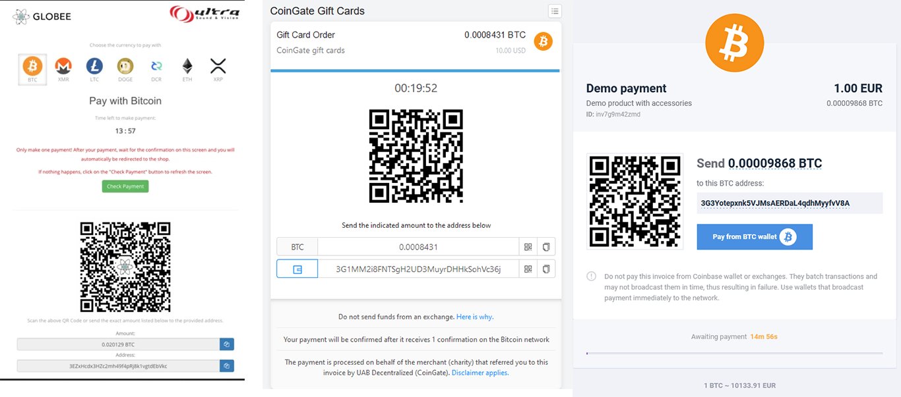
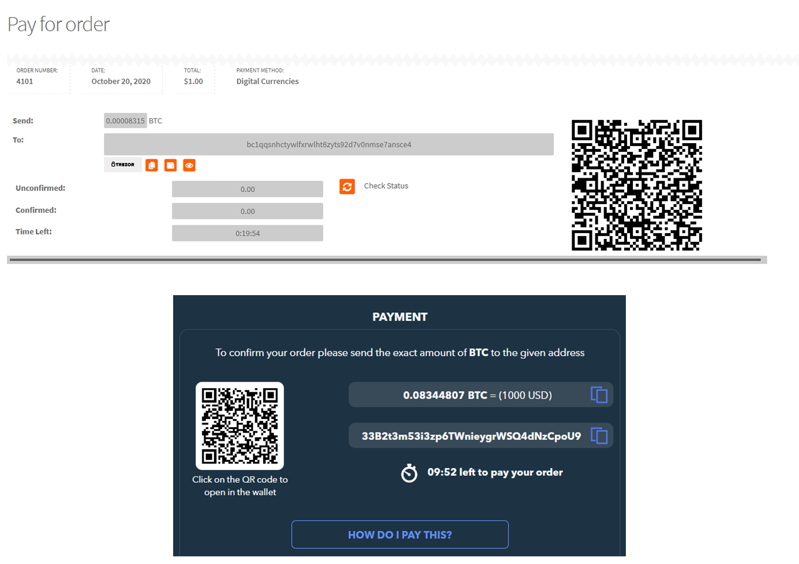

# Invoicing and invoices in Bitcoin payments in a merchant context

This document tries to explain merchant invoices in Bitcoin payments. The invoices and invoicing mentioned here, refer to payment processing in retail or online business, where the receiver, referred to as the merchant or a seller is using some sort of a payment gateway to accept Bitcoin payments.

## Motivation

The document is targeted towards designers and developers working on designing or developing an e-commerce tool to accept Bitcoin payments.

The goal is to compare and showcase essential components used by various payment gateways, understand how they interact with one another and present them in an easy-to-understand way. 

## Invoice

Bitcoin invoice used in commerce tools, doesn’t usually differ from a regular invoice one may come across when doing a checkout at a website. It is important to note the distinction between an **invoice seen on the sender's end**, sometimes referred to as the “checkout page/invoice” and the **invoice on receiver's end**

The goal of the *invoice on the sending (buyer) side* is to provide information necessary to pay such invoice. 
On the other hand, the *invoice on the receiving side* is usually used to fulfill the order or validate payment information in case of a problem.

Majority of cryptocurrency payment processors and gateways provide standard components of an invoice, which will be dissected below.

### Components of a buyer's invoice (checkout page)


The basic components of an invoice visible to the buyer are:

* A) QR Code with encoded amount and receiving address
* B) Timer which sets invoice to expired (to avoid volatility in rates)
* C) Invoice details (Total Price in fiat, Exchange rate, etc)
* D) Total amount and an address that can be copied separately (for wallet desktop users)
* E) Open in a wallet (Pay in a wallet) a button that opens and auto-populates sender's wallet fields

### Components of a merchant's invoice

The invoice that’s appearing on merchant end needs to provide data relevant for:

* Verifying the payment
* Fulfilling the order
* Troubleshooting an issue

**Payment verification** is mostly handled by the payment processing software. In case of a problem with the payment, the payment processor notifies the merchant to take certain action,depending on the invoice status.

**Order fulfillment** data is relevant data a merchant needs to have in order to deliver the order. This kind of data is optional, and depends on the e-commerce CMS or the API settings merchant configured.

**Troubleshooting an issue** happens when usually there’s a problem with the payment or retroactively if there’s a need for a refund. Centralized payment processors have their support departments that handle this type of queries for merchants, especially processors that are custodial and convert funds instantly to fiat. The essential data needed here needs to provide information about the payment which would allow merchants an easy way to detect an issue and take action. This usually contains a transaction ID, the amount, the invoice (transaction/transactions) status.

#### Data Structure of an invoice



Here's an overview of typical data structure on an invoice on the receiver's (merchant's) side.

* A) General Invoice information – contains timestamps, invoice ID, invoice status, etc.
* B) Buyer’s information – optional used for fulfilling the order, the data can be parsed into CMS invoices like WordPress, so merchants don't need to look for this data in BTCPay in case they’re using a CMS.
* C) Product information – optional, used to provide information on what product was purchased.
* D) Invoice summary – provides quick information to quickly troubleshoot an issue or verify the payment manually if that’s needed
* E) Event logs – provide in-depth information about the status of the invoice and it’s transaction on the blockchain.

##### Data Structure - Code examples

```json
{
  "amount": "string",
  "currency": "string",
  "metadata": "string",
  "checkout": {
    "speedPolicy": "HighSpeed",
    "paymentMethods": [
      "string"
    ],
    "expirationMinutes": 0,
    "monitoringMinutes": 0,
    "paymentTolerance": 0
  },
  "id": "string",
  "createdTime": 0,
  "expirationTime": 0,
  "monitoringTime": 0,
  "status": "New",
  "additionalStatus": "None"
}
```
## Payment Processors - Comparison of invoice design 







## Common problems buyers have at a checkout 

Regardless of the payment gateway used, there are some common problems that buyers have when they're preforming a checkout.

### Paying from an exchange (underpaid invoice)

**Problem**: Oftentimes, the buyer pays an invoice from an exchange. Unfortunately, some exchanges consider that a withdrawal, deducting usually a small fee from the total, without communicating that in the UI. That means that once the payment reaches the merchant, it becomes underpaid. Majority of payment processors would then notify via the invoice that there’s a due amount. 
However, even when the user buyer pays, due, the will again be deducted and invoice – underpaid. This not only causes frustration on the buyer’s end, but also increases the cost for the merchant. 
Buyer paying from multiple outputs means that the fee for a merchant who needs to move those funds later will be higher.

**Solution**: Educating both users and exchanges about the potential setbacks when paying directly from an exchange. Exchanges should communicate more transparently and clearer in their UI if they’re deducting a fee from the total.

### Invalid address (Legacy to Bech32)

**Problem**: When a sender is using a legacy wallet and paying to a receiver using Bech32, the majority of wallets provide a poor warning saying that the address is invalid. This causes confusion on the sender's end, leading them to think that the receiver provided an incorrect address.

**Solution**: Besides pushing wallets to adopt Bech32, wallets should provide better and clearer error messages to the end-user. Merchants could use P2SH to mitigate.In my opinion P2SH is just a patch not a solution.  A solution where Bech32 invoice can fallback to P2SH would be a good balance.

### Support tickets

#### BTCPay Server

* "What is the payment link" / "Do I use the address or the payment link" 
* QR Code related: "What is this square thing, don't you take debit/visa/paypal?"

Additional resource: [A list of awesome payment processors](https://github.com/alexk111/awesome-bitcoin-payment-processors).