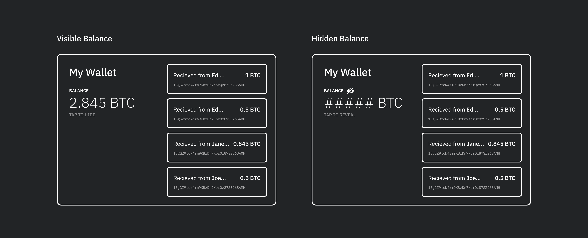
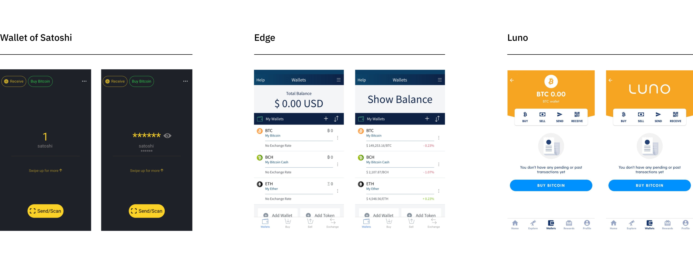
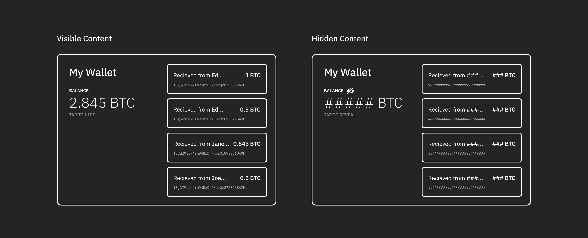
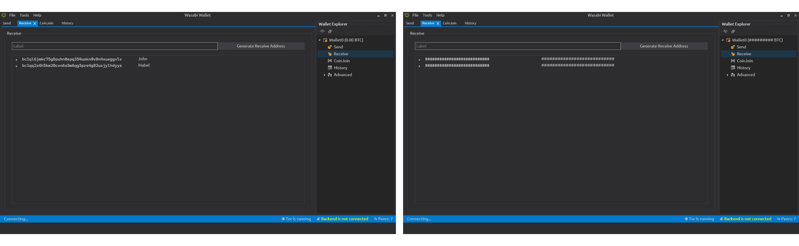
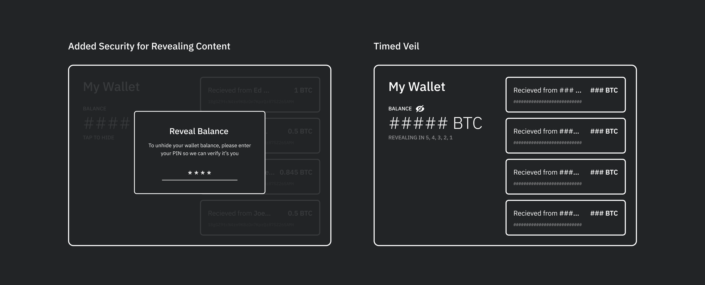

# Hiding Sensitive Information in Bitcoin Wallets

## Abstract

Imagine this scenario. You are in a public place, and you need to make a payment using your bitcoin wallet. You open your wallet on your phone, but you don’t feel comfortable having your address and balance information displayed in public. This here a problem because you probably want to feel safe whenever you use your wallet in public, instead of worrying if someone might be looking over your shoulder.

Privacy in bitcoin payments goes far beyond hiding balances and other sensitive information, however it is clear they could play a big part in it. By giving users the ability to hide their wallet’s information if desired, they gain an added sense of privacy and security when making payments.

## How Information is Hidden in Bitcoin Wallets

Although the hiding of information isn’t incorporated into many bitcoin applications, a few wallets like Wasabi, Wallet of Satoshi, and others have. These are some of the methods they have used:

### Solution 1: Tapping on the Balance to Hide and Reveal It

In this method, the hide icon / button is usually displayed within close reach of the balance itself. Users can quickly and easily hide information by tapping on this button. This method, though quick and easy to use, only provides the user with a limited amount of privacy. All other addresses, transactions, and other information that you may want to keep private are still very much visible.



*This hidden balance feature is currently implemented by:*

#### Wallet of Satoshi

In this wallet, when the “Hide Balance” feature is selected, the balance on the home screen is hidden (in both BTC and $USD or other native currency), but the addresses and their transactional data are still visible.

#### Edge

In this wallet, there is no “Hide Balance” button or toggle, the user simply has to tap on their balance. After doing this, a large “show balance” is displayed on the screen to reverse the action.

#### Luno

In this wallet, there is also no use a “Hide Balance” button or toggle. Like Edge wallet, the user hides their balance by tapping it. The Luno logo is then displayed in its place.



```
Pros
- Quick for the user to hide and unveil their balance

Cons
- It doesn't do much for security if every other sensitive information is still displayed on the screen.
- Anyone other than the user can easily reveal the balance (given they have access to the users phone and wallet)
```

…

### Solution 2: Tapping on the Hide Icon Hides Balances, Addresses and Transactions

This method, implemented by Wasabi wallet, hides and veils sensitive information more thoroughly. Not only the balance is hidden but also the addresses and the transactions associated with the wallet. Wasabi also make this feature convenient for the user by hiding all sensitive information by clicking a single button as opposed to multiple.



#### Wasabi Wallet

In this wallet, when the hide balance icon (eye) is selected, the balance on the home screen is hidden as well as your bitcoin address.



```
Pros
- Gives the user an added level of security and a sense of comfort when all sensitive information is hidden (balances, addresses, and transactions are hidden.
Cons
- Again, the hidden information can easily be revealed.
```

### Proposal: Ideal Design Solution

In this part of the article, we will discuss an improved design solution that iterates on the versions already implemented above.

#### Solution 1

A problem that seemed to arise throughout each version of implementation was that is was as easy to reverse the hidden state as it was to create it. This may be for convenience sake, however, if you are in a situation where you are concerned about your wallets security, perhaps this feature should be locked unless a PIN or password has been entered. This could therefore reaffirm the identity of the wallet owner for extra security.

#### Solution 2

Another solution would be to invoke the wallet’s hidden state as a standard when the app is opened. It is often after a financial app is opened that you might look behind you to see if there is anyone looking over your shoulder. If they are, by this point it might be too late to hide your balance. Therefore, it might be more useful to implement a pre-hidden state that unveils itself after a tap, PIN entry, or perhaps a short 5 second timer.



### Why is this pattern important to designers?

The privacy by design framework states that privacy should be incorporated and built into products by default. This way, whether or not the user is concerned with their data privacy, they would always be protected through good UX.

By including the hiding information pattern in design of wallets, we give users a greater sense of control and comfortability in any environment when using it. They have the freedom to decide whether or not they want their information visible.


[^1]: https://medium.com/@olanrewajusodiq64/the-ui-ux-of-hide-balance-designing-to-improve-asset-security-e4b20668f315
[^2]: https://www.invisionapp.com/inside-design/designing-for-privacy/
[^3]: https://uxdesign.cc/how-to-design-with-privacy-in-mind-24c96cfc2611
[^4]:  https://github.com/bitcoin-core/gui/issues/82

