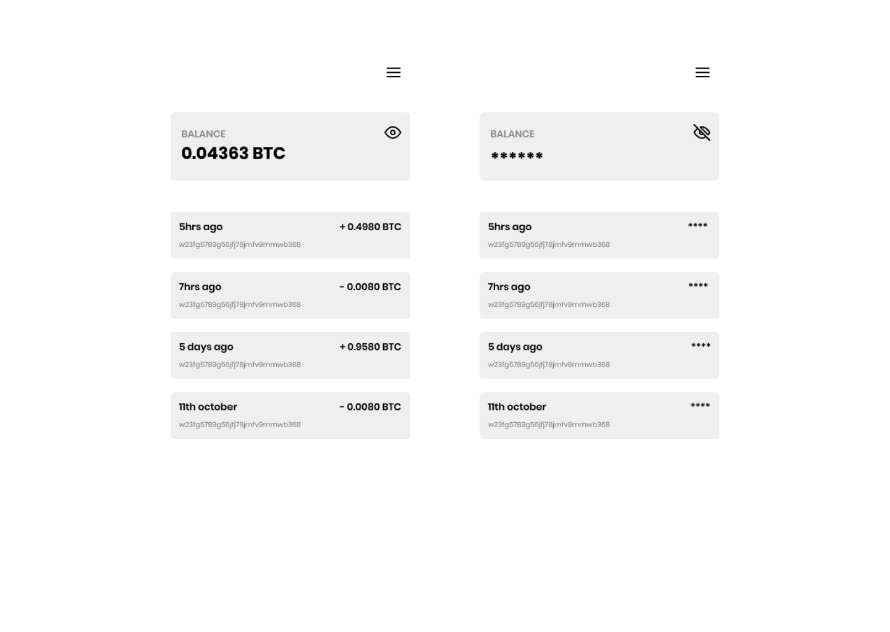
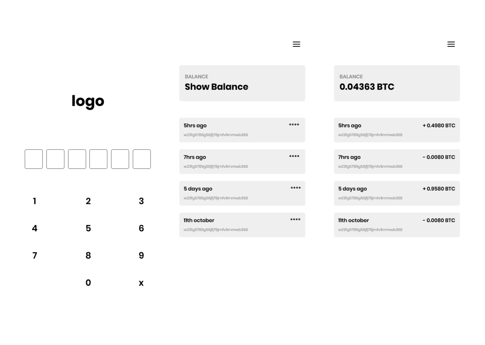

# Hiding sensitive information in bitcoin wallets

## Abstract

Imagine this scenario. A user is in a public place, they need to open up their bitcoin wallet to maybe make a payment but they don't feel comfortable enough to have their balances displayed in bold on their phone screens once the wallet is opened. This here a problem because users want to feel safe whenever they use their wallets.

This is where the ***hide balance*** feature comes in handy. With this feature, users have the ability to conceal their wallet balance and possibly transactions made, when they feel the need to.

## Methods

The hide balance feature can be achieved in the following ways:

### Hide and reveal balance with the eye icon on screen

On the home screen, next to the balance, there could be an eye icon which when tapped, would hide the balance and when tapped again, would reveal it

### Hide balance by default on wallet launch

Here, the wallet balance is hidden by default. the user can then reveal it if they choose to

### Applications that use this feature

#### Wallet of Satoshi

- Launch app
- open side nav
- select "advanced settings"
- select "hide balance"

#### Edge wallet

- launch app
- tapping on the balance hides it automatically

#### Wasabi Wallet

- launch app
- click eye icon to hide and reveal balance. It also hides addresses

## Why should designers use this feature

By including this feature in design of wallets, the designers give users more sense of privacy when they use the app. To some users this also provides a little bit of security as a large balance, when discovered by others, puts the owner at risk of being targeted.

