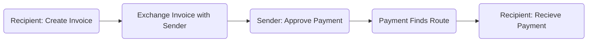
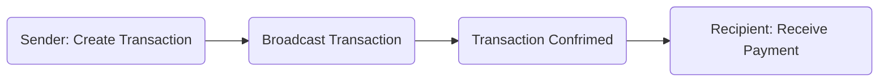

# Payments

## Abstract

There are many types of operations a bitcoin transaction can facilitate. This research will focus on the ones relating to payments.

- https://twitter.com/NicolasDorier/status/1303356212705030144
- http://bitcoin.sipa.be/miniscript/

### Payment Operations

- Initial Funding
- Self Transfer / Refill
- ...

## Motivation

There are limitations in the current system that make payment services inaccessible in many places in the world — not everyone has access to bank accounts, identification, proof of address or are in countries which support the use of modern financial services like Cash App, Strike, Monzo, Visa, etc.

The objective is to expose Bitcoin designers and wallet developers to use cases, user patterns, data structures and communication relating to payments — focusing on users in frontier and developing markets.

The process will include exploring what takes to make a complete end-to-end payment experience on Bitcoin and Lightning in a way that is familiar and seamless between the two networks, while finding ways to use these UX patterns as hooks that can maximise the use of transactions; and improve the privacy of the payment. An example would be using payment requests for Payjoins, or redirecting the change outputs too refill a lightning channel.

## Output

The output, is documentation and tools that is between technical and visual — which aims to bridge the divide between design and developers.

## Writing Style

In order to improve user experience we must equip designers with the knowledge of the underworkings of the protocol and relevant standards.

This means that some technical concepts must be communicated. It should be done with empathy for a designer who is new to bitcoin.

## Networks

### Bitcoin Onchain

Simmilarities: `Bank`, `SWIFT`, `SEPA`

- Bitcoin is a blockchain
  - What is a blockchain?
  - Link to getting started guide
- Transactions Throughput.
- Settlement network.
- Is not reversable.
- Final source of truth.
- 7 transaction per second
- Censorship Resistant
  - Bank Blocked the account for a couple of non-proits or groups
  - Prominant protestors accounts blocked
  - https://www.coindesk.com/nigerian-activists-bitcoin-endsars-police-brutality

### Bitcoin Lightning Payments

- https://medium.com/galoymoney/lightning-as-a-retail-payment-system-part-1-7463c46342ef
- Does not have final settlement but can facilitate instant payments.

> Lightning Network cannot support large payment amounts. Liquidity in payment channels on the Lightning network is a scarce resource. Nodes which relay lightning payments always take care that a payment does not exhaust their liquidity. Users of Lightning today must often be aware of inbound liquidity, outbound liquidity and channel rebalancing. There even exist services today which sell Lightning liquidity.[^3]

> it seems hard to imagine that Lightning Network will ever reliably route payments of 200 BTC to any node in the network (and it doesn't have to to be successful)

## Concepts

### Pull Payments

##### Lightning

- [ ] [DIAGRAM: User Flow of Pull Payment]
- [ ] Beyond the technical implication, to the user are lightning payment push payments if invoices are being issued?
- [ ] Default lightning user flow

### Push Payments

#### Onchain

> Traditionally, to make a Bitcoin payment, a receiver shares their bitcoin address and the sender later sends money to this address. Such a system is called `Push payment` as the sender initiates the payment while the receiver may be unavailable, in effect `pushing` the payment to the receiver.[^1]

> This is, rather, the closest analog we have in the digital world to a person-to-person cash payment.[^2]

#### Lightning

- [ ] `keysend` and its limitations

[^1]: https://docs.btcpayserver.org/PullPayments/ "BTCPayServer Pull + Push Payments"
[^2]: https://www.coincenter.org/education/crypto-regulation-faq/how-are-payments-with-bitcoin-different-than-credit-cards/ "How Are Payments with Bitcoin Different than Credit Cards?"
[^3]: https://gist.github.com/chris-belcher/9144bd57a91c194e332fb5ca371d0964