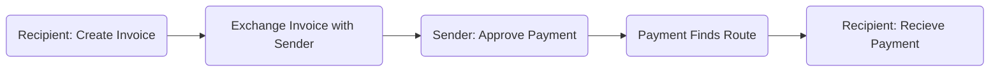
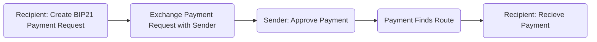
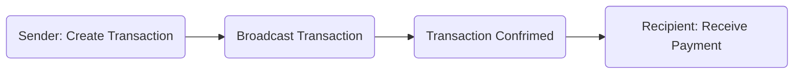

# Push Payments & Subscriptions

## Push Payments

> Bitcoin payments are analogous to wire transfers or cash transactions, where payment is "pushed" directly from one party to another, without going through another financial institution.[^0]
>
> Bitcoin payments cannot be reversed and can only be returned by the recipient — a key difference from credit card payments which can be taken back by the bank.

> Traditionally, to make a Bitcoin payment, a receiver shares their bitcoin address and the sender later sends money to this address. Such a system is called `Push payment` as the sender initiates the payment while the receiver may be unavailable, in effect `pushing` the payment to the receiver.[^1]

> This is, rather, the closest analog we have in the digital world to a person-to-person cash payment.[^2]

All bitcoin payments are push payments — even on lightning network.

## Pull Payments

- [ ] Intro — what is a pull payment?

### Subscriptions

Pull Payments are typically used for subscriptions — it requires no user interaction and a merchant or service provider is able to take money out of your account every month.

This online companies rely on this model typically rely on users forgetting to cancel their subscriptions.

This is an opportunity for designers — putting the user back in control of their money. A merchant doesn't need to necessarily pull it for it to be regular/recurring, it just requires the wallet to keep a record of the payment amount and the destination to send the payment.

#### On-chain

- [ ] `output descriptor`
- [ ] `btc-pay-server`
- [ ] How to get new invoices / addresses from the merchant?
- [ ]  Metered services / Pay per use — Invoices with a 30 day expiration that update

#### Lightning

- [ ] `keysend`
- [ ] `lnurl-withdraw`

## Typical User Flows

#### Lightning

##### With Payment Request

  Payment Requests for Lighting Payments need to follow the [BOLT 11](https://github.com/lightningnetwork/lightning-rfc/blob/master/11-payment-encoding.md) specification.

##### Without Payment Request

- [ ] `keysend`

#### On-chain

##### With Payment Request

  Payment Requests for On-chain payments can either be done by exchanging an address or a BIP21 URI.

##### Without Payment Request

  If the sender already has an xpub for the recipient, then it's possible for them to push a payment without the recipient sending a payment request (address).

[^1]: https://docs.btcpayserver.org/PullPayments/ "BTCPayServer Pull + Push Payments"
[^2]: https://www.coincenter.org/education/crypto-regulation-faq/how-are-payments-with-bitcoin-different-than-credit-cards/ "How Are Payments with Bitcoin Different than Credit Cards?"
[^0]: https://www.investopedia.com/articles/forex/042215/bitcoin-transactions-vs-credit-card-transactions.asp