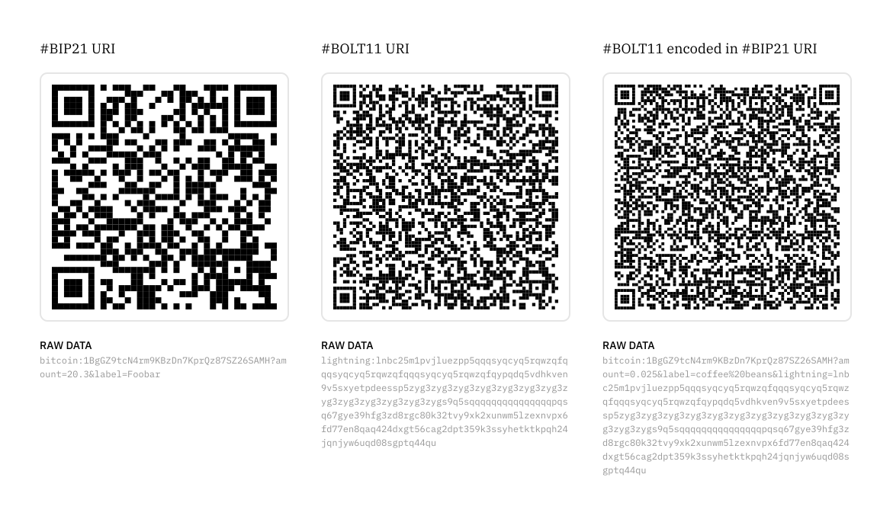
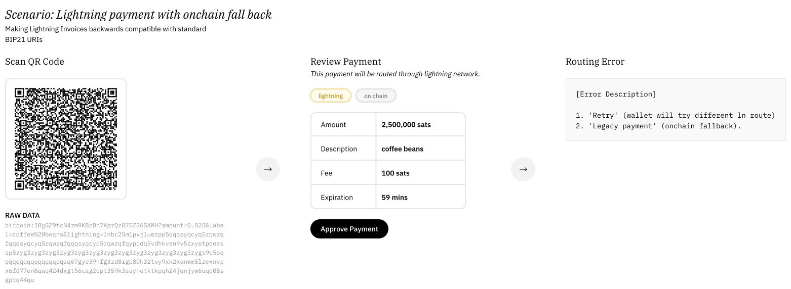

# Bitcoin ❤️ QR Codes

## QR Code

- [ ] What is a QR Code?
- [ ] Use cases in bitcoin

### Rationale

Why bitcoin ❤️ QR Codes?

- [ ] Hashing and cryptography produces lots of bit vomit
- [ ] Manual input of bit vomit is impractical for users
- [ ] Easy to transfer bit vomit through scanning
- [ ] No app required

### Technical

- QR codes can hold up to 7,089 numeric characters and up to 4,296 alphanumeric characters value of data[^1]
- QR Code has an error correction capability.[^1]

## URI

- Registering an App as the Default Handler
- Considerations on Mobile Operating Systems
  - Multiple applications battling for bitcoin and lightning URIs

## URI Schemes

### BIP21 URI

This is the standard payment request standard for bitcoin (onchain wallets).

#### Data Structure

Simmilar to a URL you may have come across BIP21 uses parameters which are relatively human readable.

- Address
- Label
- Message
- Amount

### BOLT11 URI

#### Data Structure

Lighting Invoices are encoded — 

- Amount
- Description — is a short description of the purpose of this invoice[^6]
- Description Hash — is the SHA256 hash of a description of the purpose of this invoice.[^6]
- Expiration
- Fallback (Onchain)
- Timestamp (creation)

## BOLT11 invoices encoded in BIP21 URIs

User flow visualising a wallet supporting both onchain and lightning payments, with lightning set as the default and the onchain fallback in the event of errors.[^2]

### Rationale

- There are more wallets which have BIP21 implemented than lightning network (asumption).
- Payers wallet supports both lightning network and bitcoin on-chain.

— *Assumptions* ☝️

- [ ] 

- [ ] Allow user to over-ride wallets' default network (lightning)
- [ ] Continue onchain flow after error message
- [ ] Consider automatic error handling?
- [ ] Talk about duplicated payment meta data (description/label), increased data size of the qr code leads to more difficulty with scanning

### Drawbacks

- [ ] QR Complexity
  - QR Codes with more modules are difficult to read on devices with low resolutions
  - Duplicated Data

### Implementations

- [zap-desktop](https://github.com/LN-Zap/zap-desktop)
- [RESEARCH TASK]

[^1]: https://www.krishisanskriti.org/vol_image/30Jan201902013002b%20%20%20%20%20Aquil%20Ahmad%20Khan%20%20372-374.pdf "Journal of Basic and Applied Engineering Research / p-ISSN: 2350-0077; e-ISSN: 2350-0255; Volume 5, Issue 5; July-September, 2018, pp. 372-374"
[^2]: https://www.reddit.com/r/Bitcoin/comments/8wyloi/making_lightning_invoices_backwards_compatible/ "Making Lightning Invoices backwards compatible with standard BIP21 URIs"
[^3]: https://github.com/LN-Zap/zap-desktop/pull/3131 "Support bolt11 invoices encoded in bip21 uris"
[^4]: https://github.com/lightningnetwork/lightning-rfc/issues/323 "Add BIP21 fallback example to Bolt11"
[^5]: https://github.com/lightningnetwork/lightning-rfc/blob/master/11-payment-encoding.md#encoding-overview

[^6]: https://github.com/lightningnetwork/lnd/commit/af01571fc61dfab2f5813050dc59c40e7c00be20#diff-432eb1b004c63792f9852a3eeb377f2468fac664524de260a0fc0c5c12e6ea32L154-R161